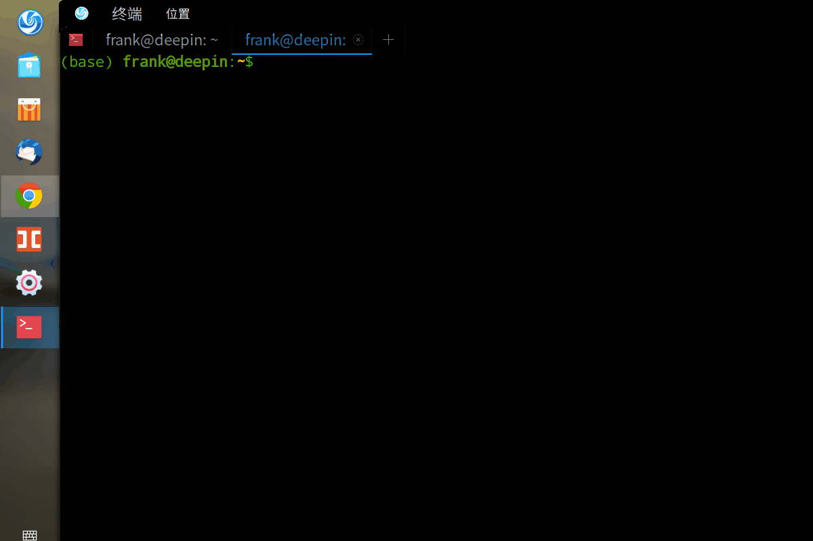

# [运维经--目录](https://blog.csdn.net/xk_xx/article/details/104141649)
### sl让你长记性的工具
> 你是不是经常会遇到ls敲错的情况？敲成sl或者SL，更重要的是你还不长记性！今天介绍一个小东西，帮你长点心～

1. ubuntu: sudo apt install sl
2. linux: sudo yum install sl

OK,试一下吧。

小火车，呜呜呜，越着急你越什么也干不了。