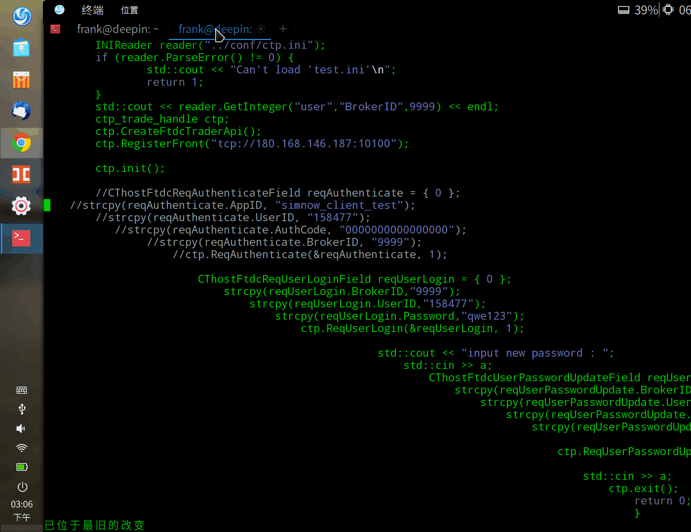

# [运维经--目录](https://blog.csdn.net/xk_xx/article/details/104141649)
### vim格式化代码
> 有时候我们会将代码复制到vim里面，如果你的vim设置了autoindent，那么你的缩进会很糟糕，这时候vim的格式化代码功能就能派上用场了。

1. 选择要格式化的文本内容：分别键入以下命令：
> gg(回到首行) - v (可视化模式)-  G(到尾行)，我这里是全选。
2. 格式化文本：按下 =

